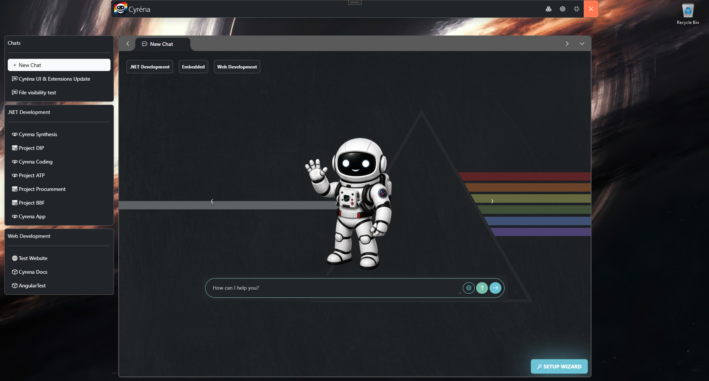
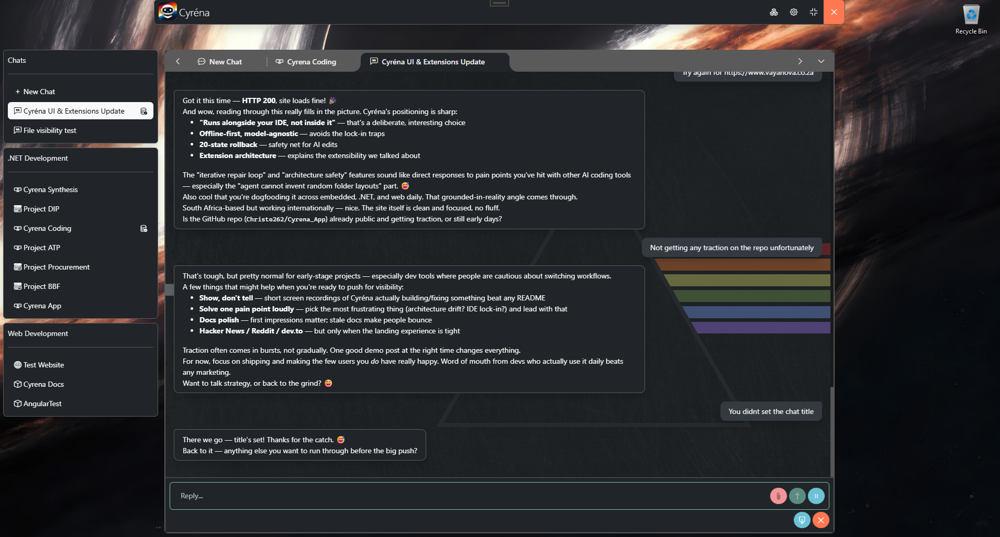

# Cyréna HUD

The same capabilities, a different experience.

Cyréna HUD is the same application with a different experience.

Use the same models, extensions, workflows, and project context through a Heads-Up Display designed for instant access.

The Windows HUD can be summoned or hidden instantly using a configurable hotkey (default: Ctrl+Shift+Q), keeping Cyréna available without taking over your desktop.

