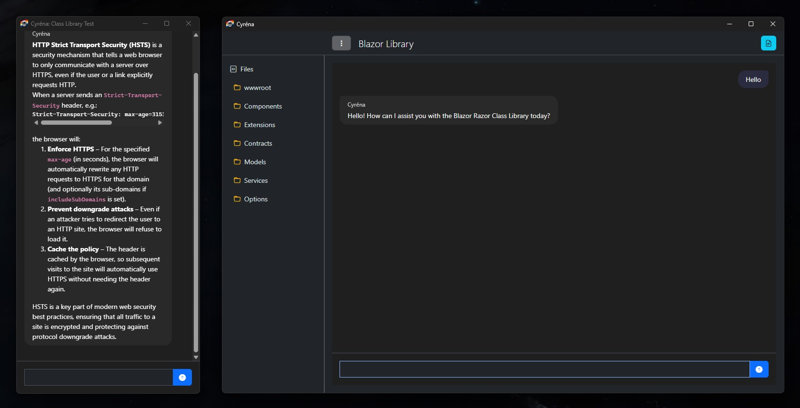
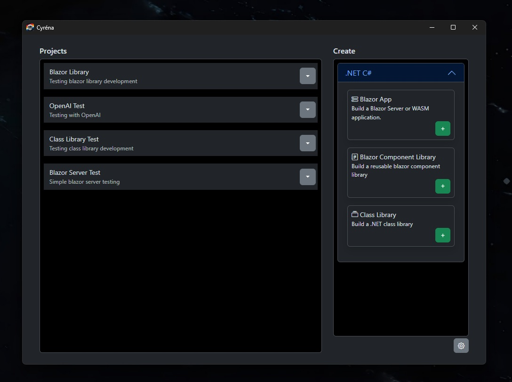
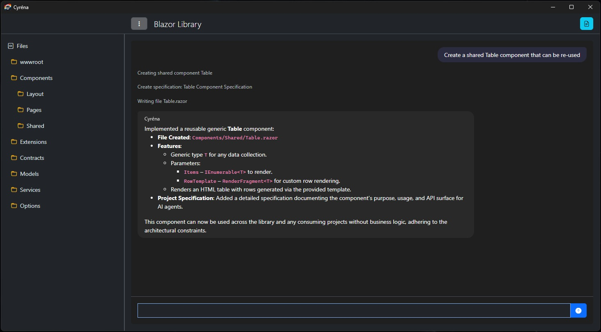
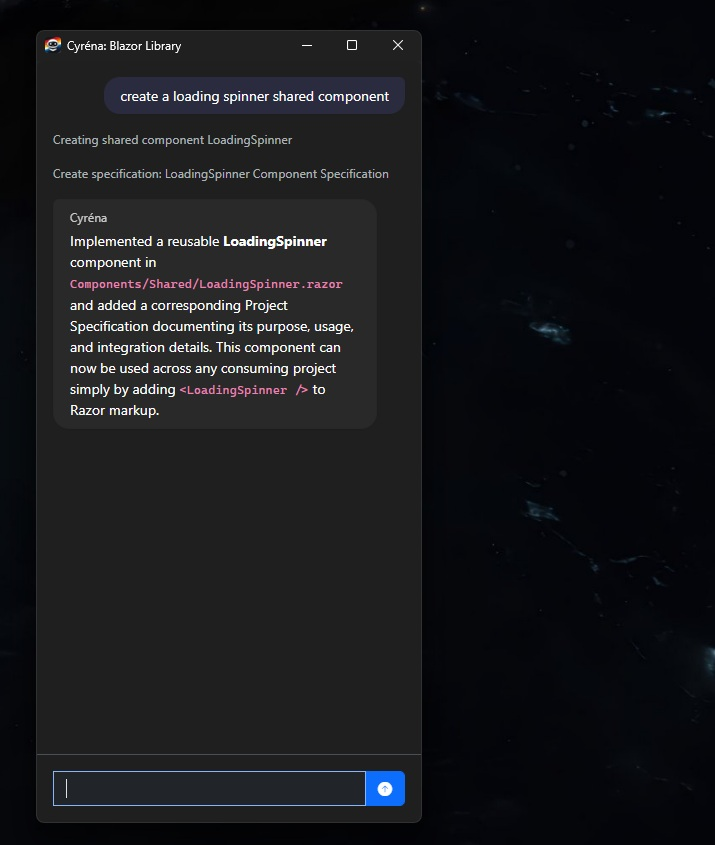
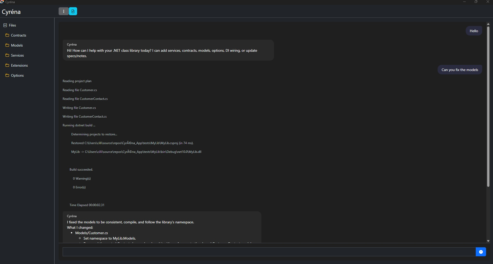
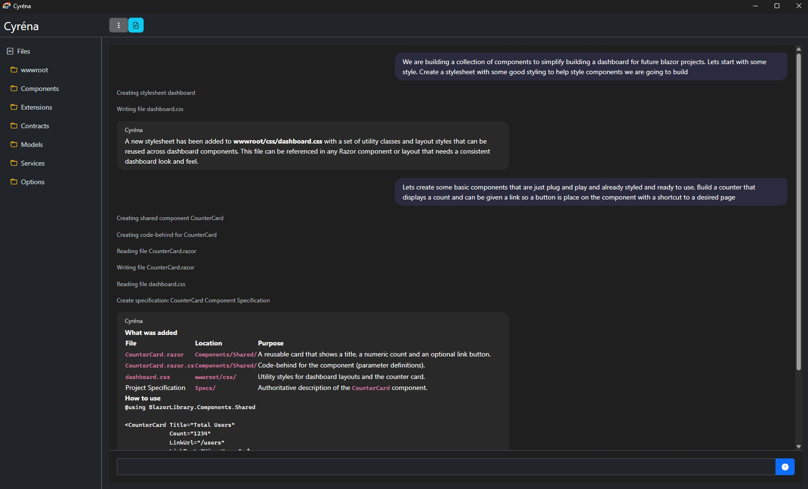

# Cyréna Screenshots

## Dual Working Modes

Cyréna supports two working styles:
**Project Mode** for full development workflows, and **Assistant Mode** for a lightweight companion window that stays out of your way while you code.

---

## Launch Window

Cyréna entry screen for opening or creating projects.

---

## Project Mode

Full development workspace with file explorer, structured editing, and architecture-aware assistance.

---

## Assistant Mode

Minimal companion window for quick chat while you work — designed to stay out of the way.

---

## OpenAI Integration

Cyréna working with OpenAI models inside a real project workflow.

---

## Blazor Class Library Development

Generating reusable Blazor components and structured project specifications.
