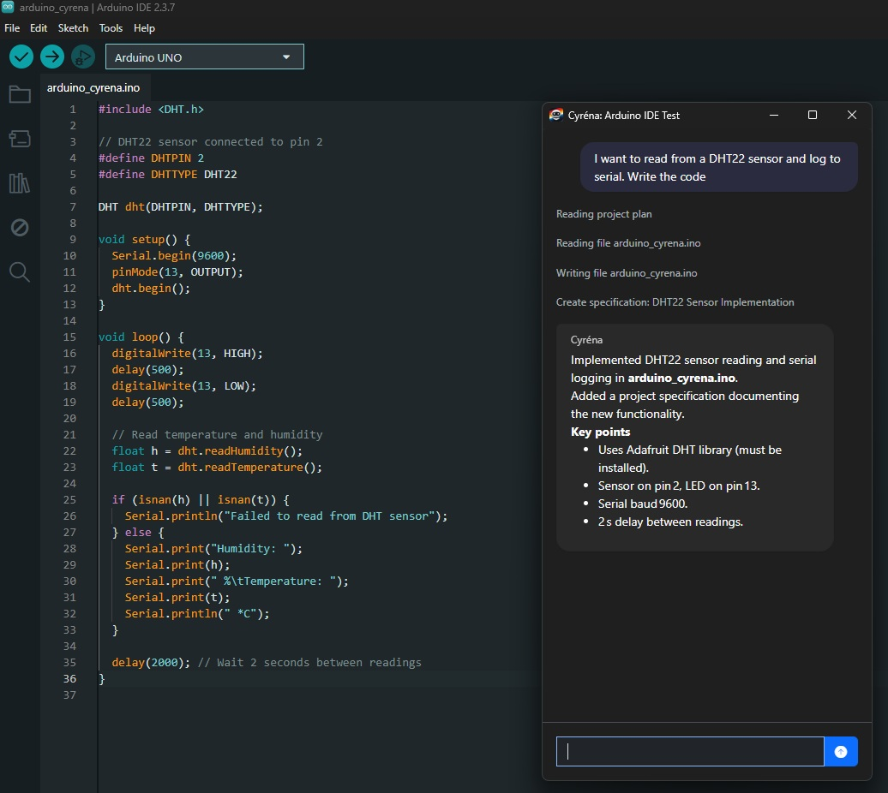

# Cyréna Screenshots

## Dual Working Modes

Cyréna supports two working styles:

**Project Mode** — full structured development workflow  
**Assistant Mode** — lightweight companion window that stays out of your way

Use the mode that fits your workflow.

---

## Launch Window

Entry screen for opening existing projects or creating new ones.

---

## Project Mode

Full development workspace with:

- file explorer
- architecture-aware editing
- structured AI assistance
- persistent project knowledge

Designed for real engineering work, not chat.

---

## Assistant Mode

Minimal companion window for quick interaction while you code.

It floats beside your IDE and stays unobtrusive.

---

## OpenAI Integration

Cyréna operating with OpenAI models inside a real project workflow.

The agent respects architecture and modifies real files safely.

---

## Blazor Class Library Development

Generating reusable Blazor components and maintaining structured project specifications.

Cyréna enforces project discipline while extending real codebases.

---

## Arduino Firmware Development

Cyréna assisting with Arduino firmware:

- constrained embedded workflows
- library awareness
- safe sketch modification
- project specifications
- repair loops

The same agent architecture, applied to a different domain.
