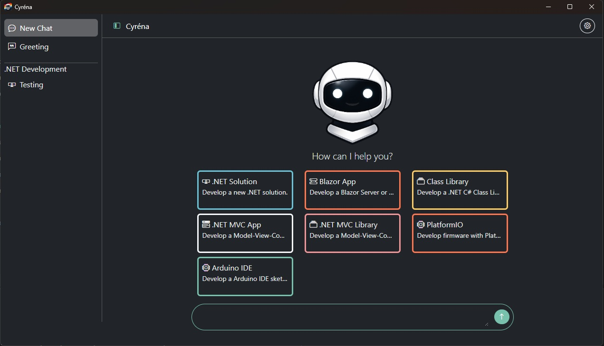
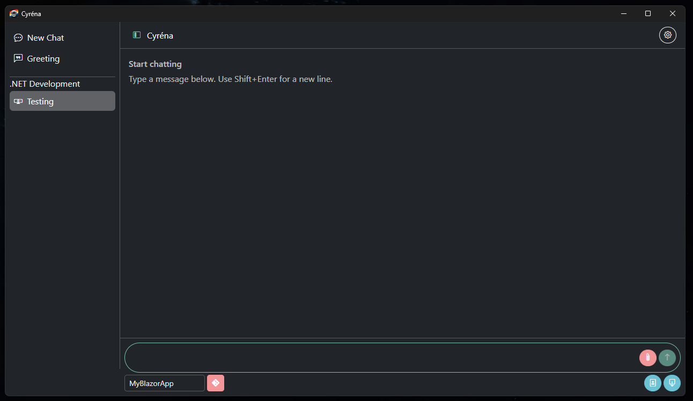
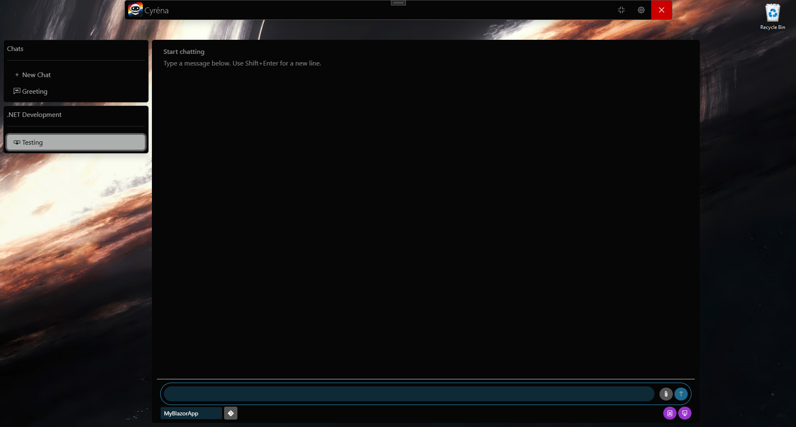
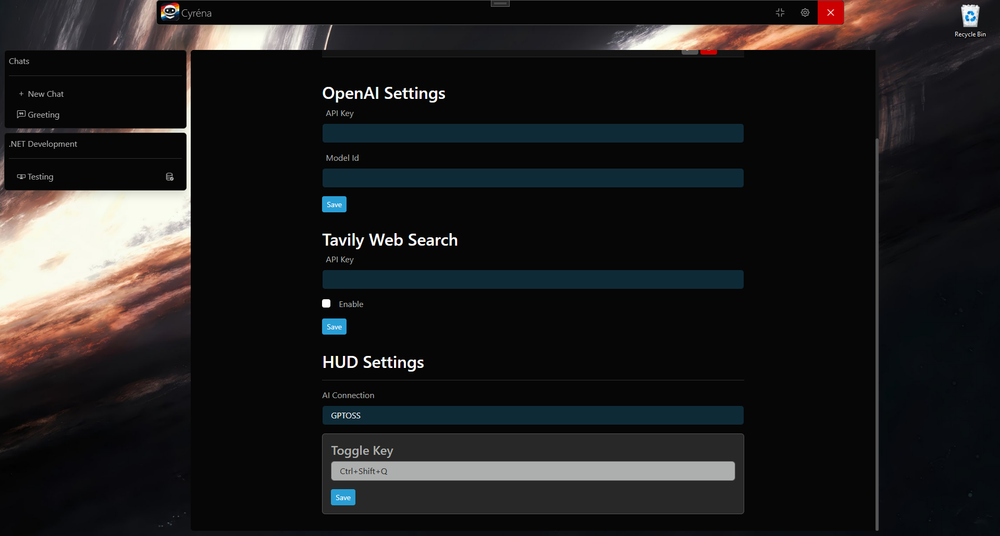
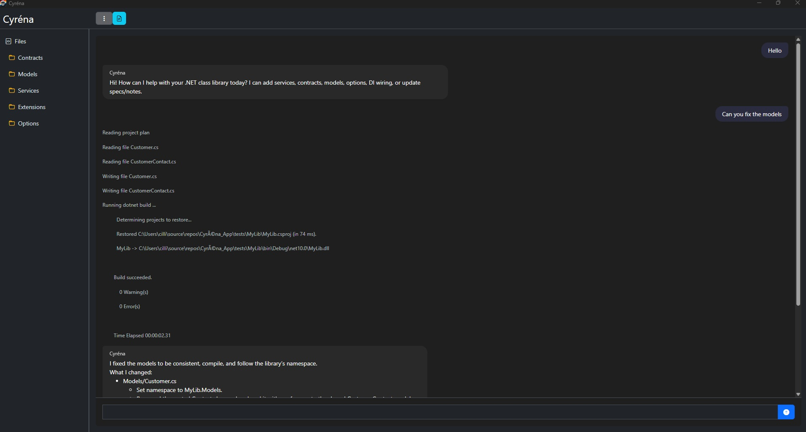
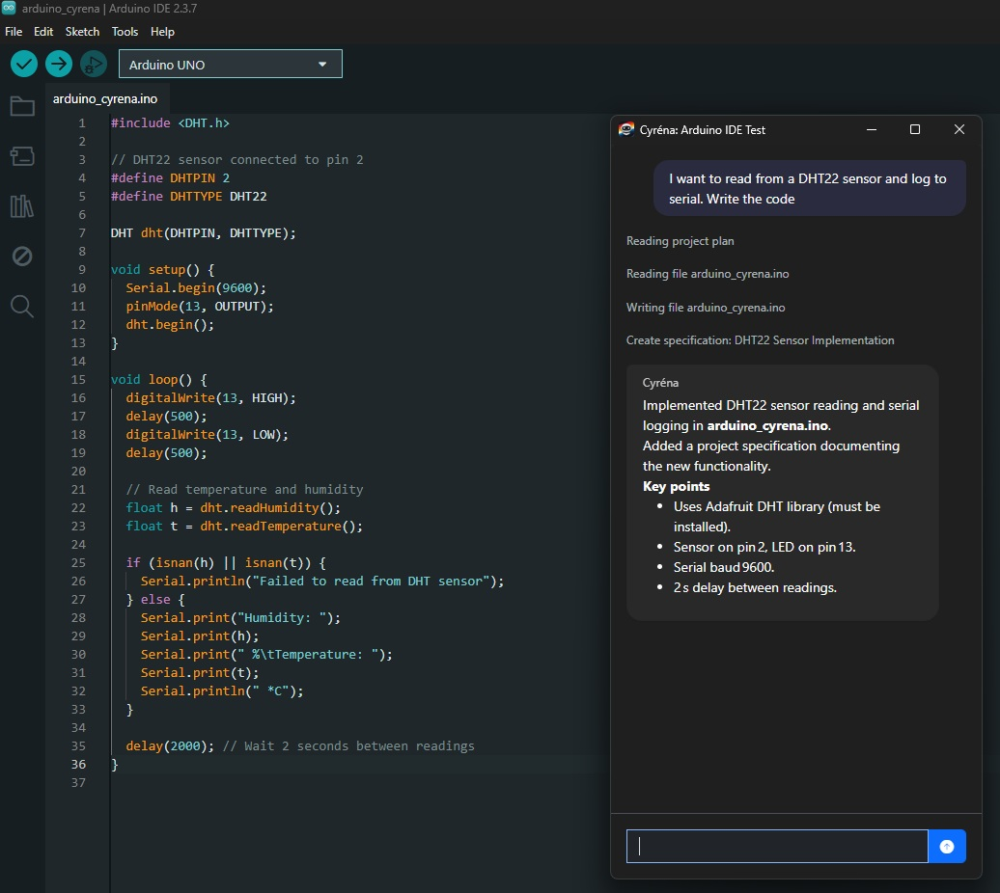

# Cyréna Screenshots

## Launch Window

## Working

## HUD

#### HUD Settings

## OpenAI Integration

*Old UI*

Cyréna operating with OpenAI models inside a real project workflow.

The agent respects architecture and modifies real files safely.

---

## Arduino Firmware Development
*Old UI*

Cyréna assisting with Arduino firmware:

- constrained embedded workflows
- library awareness
- safe sketch modification
- project specifications
- repair loops

The same agent architecture, applied to a different domain.
