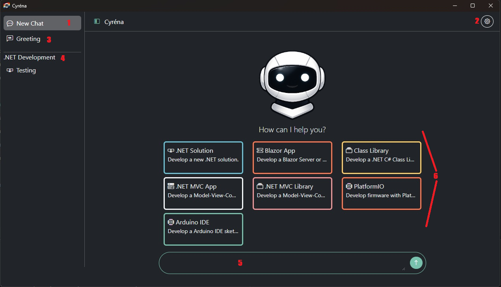
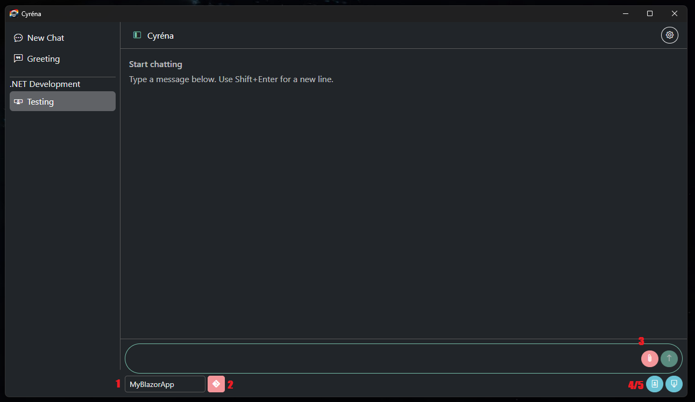

# UI Overview

1. Navigate to launch window
2. Settings
3. General Chats, not for development
4. Working Projects, categorised
5. New chat text area
	- Creates a new general chat not for development
6. Create coding chats

## Development

1. Project Context switching
	- Only applicable to .NET Solution & PlatformIO in case of multiple environments
2. File History
	- Tracks changes per files **per iteration**
	- Allows review of changes, revert or keep
3. File Attachment
4. API References
	- Review API References the AI generated
	- Allows editing, exporting and importing and deleting
5. Chat Export
	- Prompts to save to text file