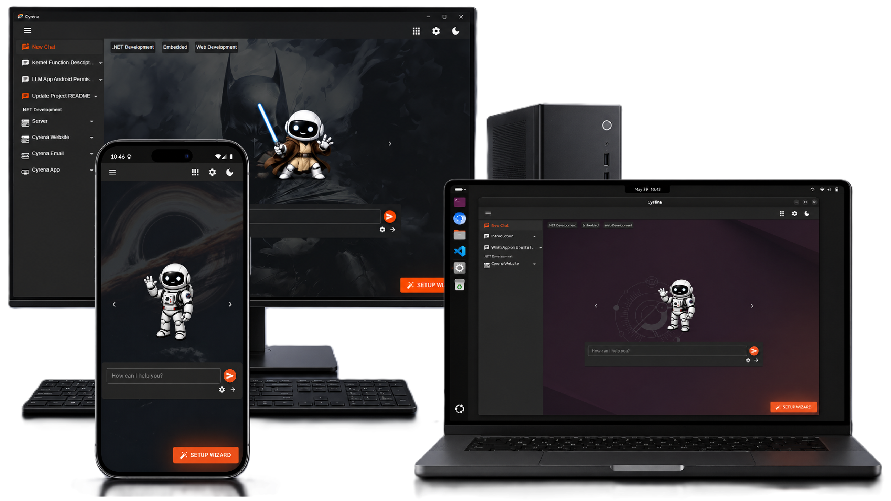

# Cyréna

> **⚠️ This project is archived and is no longer maintained.**
>
> When Cyréna started I couldn't find a good local-first, extension-driven workspace for people running their own models. There are plenty now — Ollama ships its own agent with a skills system, and [Jan](https://jan.ai), [LM Studio](https://lmstudio.ai), [AnythingLLM](https://anythingllm.com), [Msty](https://msty.app) and [Open WebUI](https://openwebui.com) all support MCP and agentic workflows. If you came here looking for an offline-first AI workspace, one of those will serve you better.
>
> The repository stays up as a reference. The parts most worth reading:
>
> - **Dynamic prompts** — `IPromptManager` plus per-iteration re-materialisation in `ChatMessageService.GetKernelHistory`, so system prompts are assembled fresh each turn from ordered fragments that extensions own.
> - **Structural feature activation** — `IAssistantPlugin`; a deactivated feature is never registered, so its tools and instructions genuinely do not exist for that conversation rather than being filtered out.
> - **API references** — `src/coding/src/api_references`; model-authored, distilled project documentation with tiered search/read and context suppression via `ISuppressibleResult`.
>
> Thanks to everyone who gave it a try.

Cyréna is an **AI-native workspace** built around extensions, dynamic prompts, and user-controlled model selection.

It gives you a single workspace where different AI assistants can be equipped with only the capabilities they need for the task at hand. You can queue work, activate or deactivate features per conversation, and switch between local or cloud models using providers like Ollama and OpenAI.

Cyréna is not just a chat app, and it is not just a coding assistant. It is a modular AI environment for software engineering, embedded development, productivity, knowledge work, and custom workflows.

**You choose the model. Cyréna orchestrates the work.**

[Download (alpha)](https://cyrena.dev/download.html) | [Website](https://cyrena.dev) | [Docs](https://cyrena.dev/docs.html) | [Screenshots](docs/screenshots.md)

👉 [Getting Started (YouTube)](https://cyrena.dev/docs.html#/docs/getting-started)

---

## What Cyréna Actually Is

Cyréna is a cross-platform application (Desktop & Android) that acts as an intelligent layer between you and your AI models. It works seamlessly with **OpenAI** and **Ollama**, giving you the freedom to use powerful cloud models or keep everything local and private.

### A Modular Ecosystem
Cyréna is built entirely around **Extensions**. This architecture allows it to expand beyond coding into any domain:

* **Engineering:** Implement features, repair build failures, and manage codebases (.NET, Angular, Embedded, etc.).
* **Productivity:** Structured task management, document synthesis, and workflow automation.
* **Knowledge:** Persistent technical memory and cross-project intelligence.
* **Custom Domains:** The ability to define new project structures and behaviors via extensions.

---

## Core Platform Concepts

### Extension-Driven Architecture
Every capability in Cyréna is an extension. This means the app doesn't become "bloated" as it grows. If you aren't doing embedded work, you don't need the Arduino extension. 

Extensions define:
* **Project Structures:** How files and data are organized.
* **Workflows:** The step-by-step process to achieve a goal.
* **Tooling Constraints:** The specific rules the AI must follow.
* **Domain Behavior:** How the workspace reacts to different types of input.

### Persistent Intelligence
Cyréna doesn't just "chat"; it remembers, though the method depends on the assistant you're using:

* **Coding Assistant:** Uses **API References** (structured technical documents) and **Sticky Notes** (lightweight, persistent architectural decisions) to maintain a grounded memory of your project.
* **General Assistant:** Can be equipped with the **Long-Term Memory extension**, allowing for cross-conversation persisted memory and personal context.

### Core Platform Orchestration
Cyréna provides a set of core features that ensure the AI remains focused, efficient, and reliable across any assistant context:

* **Prompt Queuing:** A platform-wide capability that allows you to stack multiple high-level goals and have Cyréna execute them sequentially.
* **Feature Activation:** Users can toggle specific abilities on or off for any conversation. This ensures the AI only has the tools it needs for the current task, reducing noise and potential errors.
* **Dynamic Prompts:** The instruction set provided to the AI evolves in real-time based on active features. If a feature is deactivated, it ceases to exist in the AI's world for that session, ensuring the context is always "just enough" for reliable execution.

### Iterative Loops (Coding Domain)
Specifically for the Coding Assistant, Cyréna employs a disciplined execution loop to handle complex engineering tasks:
1. **Inspect** current state $\rightarrow$ 2. **Load** context $\rightarrow$ 3. **Implement** changes $\rightarrow$ 4. **Validate/Build** $\rightarrow$ 5. **Repair** $\rightarrow$ 6. **Persist** knowledge.

---

## Supported Domains

### 💻 Software Engineering
* **.NET:** Class Libraries, Blazor, MVC.
* **Web:** Angular, Static Websites (HTML/CSS/JS).
* **Embedded:** Arduino IDE, PlatformIO (ESP-IDF, Arduino Framework).

---

## Offline-First & Model Agnostic

Cyréna is designed for total control.
* **Local First:** Full support for Ollama to keep your data on your own hardware.
* **Cloud Flexible:** Easy integration with OpenAI and other compatible providers.
* **Model Agnostic:** Switch models mid-project to find the best tool for the specific task.

---

## Requirements

### Base Requirements
* **Hardware:** 8GB RAM (Minimum)
* **AI Access:** Ollama or OpenAI API accounts
* **OS (Desktop):** Windows and Linux (Official Support). *Note: macOS may work, but is currently untested/unsupported.*
* **OS (Android):** Android Min API 24
### Test Environment (Reference)
* **CPU:** Ryzen 7 8700f
* **RAM:** 48GB
* **GPU:** 12GB RTX 3060
* **Primary Test Model:** `gemma4:31b` (via Ollama)
Cyréna is tested heavily with local and cloud-hosted Ollama/OpenAI models, including `gemma4:31b`, which provides a strong balance of reasoning quality, coding ability, and local-first control.

### Development Requirements
* **SDK:** .NET 10 SDK
* **IDE:** Visual Studio, VSCode, or JetBrains Rider
* **Android:** MAUI Workload
* **Shell (Desktop):** Blazor & Avalonia

### Project Structure
* `/src/Cyrena.Shell`: Desktop version.
* `/src/Cyrena.Android`: Android version. *(Note: This project is purposefully coded to run on Windows for testing purposes, but is intended for Android deployment).*

---

## Philosophy

Cyréna is built on the belief that AI should enhance human agency, not replace it. We focus on:
* **Disciplined Behavior:** Predictable, reversible, and supervised AI actions.
* **Architecture Safety:** Reducing entropy through project-aware reasoning.
* **User Sovereignty:** You own your code, your data, and your infrastructure.

**The goal is not magic. The goal is a better way to work.**

---

## Thanks to Open Source
Cyréna stands on the shoulders of:

[.NET](https://github.com/dotnet) | [Ollama](https://ollama.com) | [MudBlazor](https://github.com/MudBlazor/MudBlazor/) | [BlazorMonaco](https://github.com/serdarciplak/BlazorMonaco) | [Photino.NET](https://github.com/tryphotino/photino.NET) | [Avalonia](https://github.com/AvaloniaUI/Avalonia)

---

## Disclaimer
Cyréna modifies real files. **Always use version control.** You are responsible for your codebase. Provided as-is.