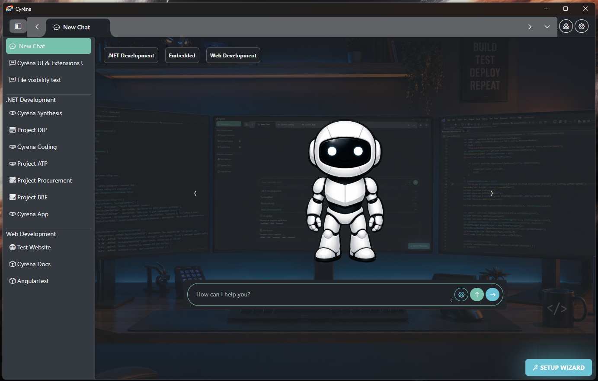
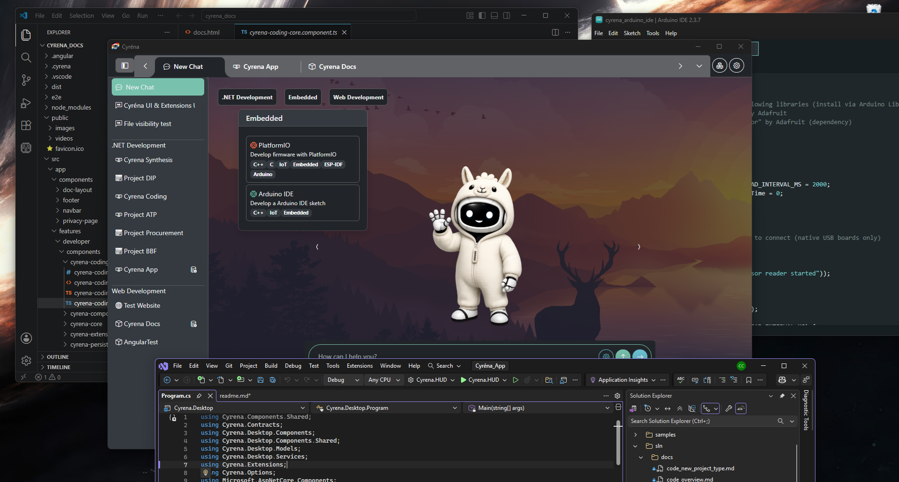

# Cyréna

Cyréna is an AI-native desktop engineering workspace that adapts to your workflow through extensions.

It runs alongside your IDE, not inside it. Extensions let you install only what you need instead of shipping a massive monolithic app.

Cyréna helps developers build, maintain, and evolve real software projects across multiple engineering domains including .NET, embedded systems, firmware, web platforms, and static websites.

You choose the model.
Cyréna orchestrates the workflow.

[Download (alpha)](https://cyrena.dev/download.html) | [Cyréna HUD (Windows)](docs/hud.md) | [Website](https://cyrena.dev) | [Docs](https://cyrena.dev/docs.html) | [Screenshots](docs/screenshots.md) | [My Model Experience](docs/model-reviews.md)

---

## Why Cyréna Exists

Cyréna was built from a practical problem.

AI app builders could generate software quickly, but the infrastructure, hosting, and execution environment remained locked behind proprietary platforms. The software was not truly mine.

Cyréna solves that by helping developers move faster with AI while keeping full control over their code, architecture, infrastructure, and deployment.

The goal is not magic.

The goal is disciplined AI-assisted engineering inside real projects.

---

## What Cyréna Actually Is

Cyréna is a desktop application for AI-assisted engineering.

It works with OpenAI and Ollama, allowing you to use cloud or local models and switch between them depending on the task.

Cyréna is designed to slot into your existing workflows and tools, enhancing and accelerating them rather than disrupting them.

It can:

* implement features
* modify existing codebases
* repair build failures
* generate documentation
* retain project-specific knowledge
* support repeatable engineering workflows

Cyréna is built around extensions.

Extensions allow support for different engineering domains such as .NET, Angular, Arduino, PlatformIO, and static websites.

The extension model also allows Cyréna to expand beyond software engineering into entirely new domains over time.

Developers remain in control of their code, infrastructure, and workflows.

---

## Demo

Watch Cyréna perform a real prompt → build → repair workflow:

👉 https://cyrena.dev

This is not autocomplete.

This is structured AI-assisted engineering inside real projects.

---

## Core Platform Concepts

### Extension-Driven Architecture

Cyréna is built around extensions.

Every engineering domain is implemented as an extension, including:

* .NET
* Arduino IDE
* PlatformIO
* Angular
* Static Website Development

Extensions define:

* project structures
* prompts
* workflows
* tooling constraints
* repair strategies
* domain-specific behavior

This allows Cyréna to adapt to different workflows without becoming a generic “AI assistant.”

---

### Dynamic System Prompts

Cyréna dynamically updates system prompts based on:

* active extensions
* project type
* enabled capabilities
* engineering domain
* current workflow context

The model only receives the instructions relevant to the active task.

This keeps prompts focused, smaller, and domain-aware.

---

### Feature Activation

Features can be enabled or disabled per chat.

Disabled functionality is removed from the model’s available toolset entirely.

This prevents:

* irrelevant tool usage
* accidental actions
* prompt bloat
* workflow confusion

The AI only knows what it needs to know.

---

### Prompt Queuing

Cyréna supports prompt queuing.

Developers can queue multiple engineering tasks and allow the platform to work through them sequentially.

Each iteration:

1. Loads relevant context
2. Inspects project files
3. Performs the requested work
4. Builds and validates
5. Repairs issues if necessary
6. Persists technical knowledge
7. Continues to the next queued task

This allows longer engineering workflows to execute in a controlled and repeatable way.

---

## Multi-Domain Engineering Support

Cyréna currently supports multiple engineering domains through extensions.

### .NET

* C# Class Libraries
* Blazor Applications
* MVC Applications
* MVC Libraries

### Embedded & Firmware

* Arduino IDE
* PlatformIO

  * Arduino Framework
  * ESP-IDF

### Web Development

* Angular
* Static HTML/CSS/JavaScript websites

Each domain has its own:

* project structures
* prompts
* engineering rules
* architecture constraints
* repair workflows

Different domains. Same engineering discipline.

---

## API References

API References are structured technical documents generated and maintained by the platform.

They provide persistent technical memory describing:

* APIs
* architecture rules
* service contracts
* module behavior
* integration patterns
* implementation details

API References are grounded in real project code rather than hallucinated summaries.

This allows Cyréna to maintain long-term project understanding beyond normal chat context limitations.

---

## Sticky Notes

Sticky Notes act as lightweight persistent project memory.

They capture:

* architectural decisions
* engineering constraints
* developer reminders
* project-specific rules
* workflow guidance

Sticky Notes survive chat resets and model switches.

---

## Project-Aware Engineering

Cyréna works directly inside real project structures.

It:

* reads existing files
* inspects architecture
* follows project conventions
* performs minimal edits
* validates builds
* repairs failures iteratively

The platform is designed to avoid uncontrolled code generation and reduce architectural entropy over time.

---

## Iterative Repair Loops

Engineering tasks operate through structured loops:

1. Inspect project state
2. Load API References
3. Read Sticky Notes
4. Review relevant files
5. Implement minimal changes
6. Build and validate
7. Repair failures
8. Persist technical knowledge
9. Summarise work completed

This approach keeps workflows controlled and repeatable.

---

## Offline-First & Model Agnostic

Cyréna is designed to work with:

* Ollama
* OpenAI
* compatible AI providers

Developers can:

* run models locally
* switch providers mid-project
* work offline
* keep code on their own infrastructure

The platform is model agnostic.

You bring the model.
Cyréna provides the engineering workflow.

---

## Static Website Development

Cyréna now includes a static website engineering extension.

The Website extension supports:

* semantic HTML5
* responsive CSS
* vanilla JavaScript
* structured project layouts
* SEO-friendly static content
* accessibility-aware markup
* asset management
* multi-page websites

This extension was used to rebuild the Cyréna marketing website from Angular-rendered landing pages into static crawlable content.

---

## Requirements

* .NET 10
* Windows / Linux / macOS
* Ollama or OpenAI
* Recommended: ≥16k context models

Hardware requirements scale with model size.

---

## Getting Started

### Setup Ollama

1. Run Cyréna
2. Open Settings
3. Add an Ollama connection
4. Configure model + tokens + context
5. Save

### Setup OpenAI

1. Open Settings
2. Add API key + model
3. Save

### Create a Project

1. Click **New Chat**
2. Select a project type
3. Configure the project
4. Submit

---

## Hardware Notes

Baseline development system:

* RTX 3060 12GB
* 48GB RAM
* Ryzen 7 8700F

Typical local test configuration:

* `gpt-oss:20b`
* 8k tokens
* 16k context

Larger models require additional VRAM and RAM.

---

## Philosophy

Cyréna is being built around:

* disciplined AI behavior
* reversible engineering workflows
* project-aware reasoning
* persistent technical memory
* predictable code generation
* developer supervision
* architecture safety
* long-term maintainability

The goal is not replacing developers.

The goal is building better engineering workflows.

---

## Thanks to Open Source

Cyréna stands on the shoulders of excellent open-source projects:

* [.NET](https://github.com/dotnet)
* [Ollama](https://ollama.com)
* [Arduino](https://www.arduino.cc/)
* [BootstrapBlazor](https://github.com/dotnetcore/BootstrapBlazor)
* [BlazorMonaco](https://github.com/serdarciplak/BlazorMonaco)
* [Photino.NET](https://github.com/tryphotino/photino.NET)
* [Bootstrap](https://getbootstrap.com/)

---

## Disclaimer

Cyréna modifies real files inside real projects.

Always use version control.
Always review AI-generated changes.

You are responsible for your codebase.

Provided as-is. Use at your own risk.
